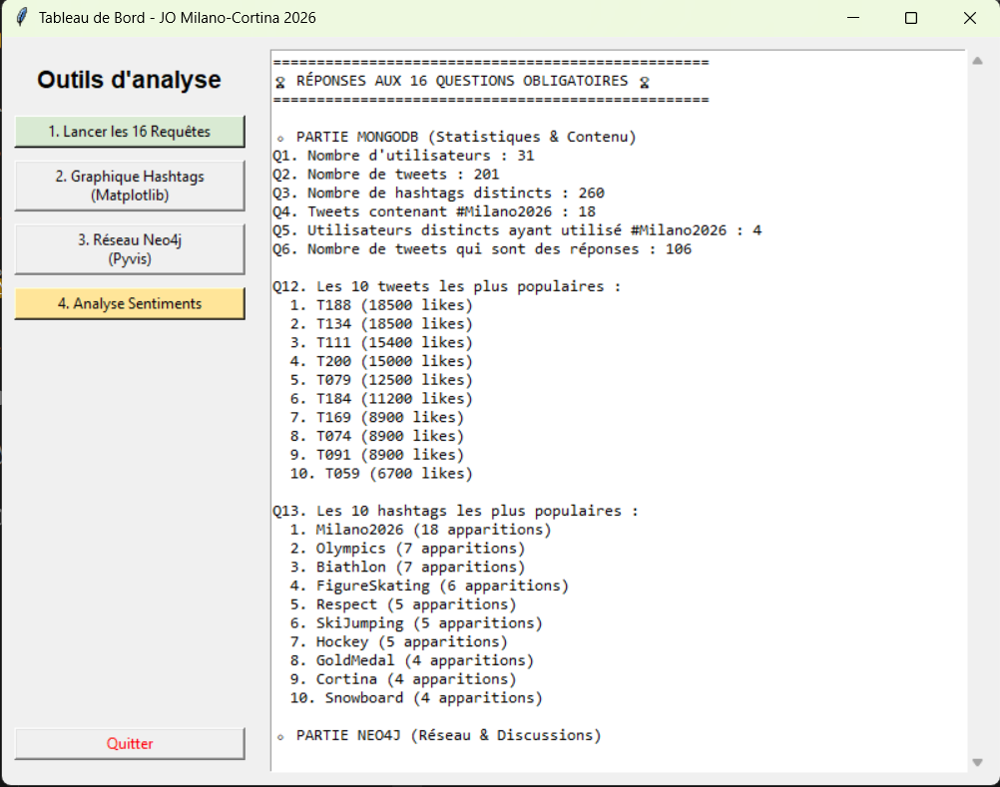
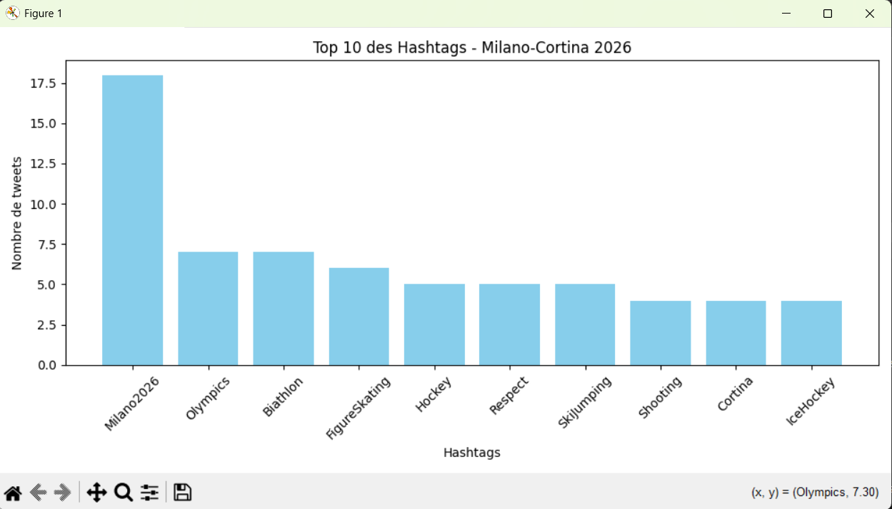
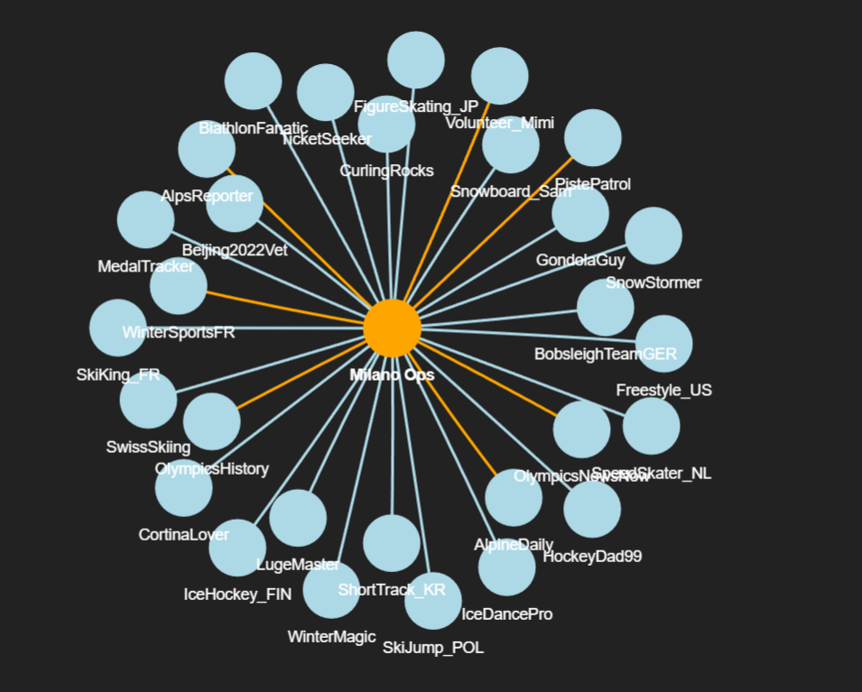
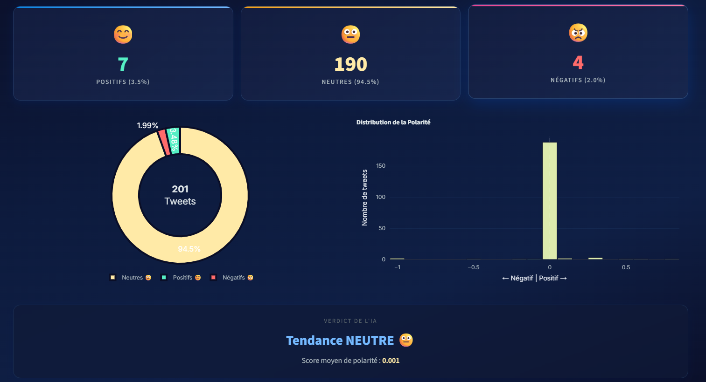

# Milano-Cortina 2026 — Social Intelligence Dashboard

> Projet d'analyse de données sociales autour des Jeux Olympiques d'hiver Milano-Cortina 2026, combinant **MongoDB**, **Neo4j** et **NLP** (analyse de sentiments).


---

## Aperçu du projet

Ce projet simule l'écosystème social autour des JO d'hiver 2026 à travers un jeu de données réaliste (30 utilisateurs, 200 tweets, relations de follow et retweets). Il met en œuvre une **architecture multi-bases de données** pour répondre à 16 questions analytiques couvrant :

- **MongoDB** : stockage documentaire, agrégations, requêtes statistiques
- **Neo4j Aura** : base de données orientée graphe, analyse de réseau social
- **TextBlob (NLP)** : analyse de sentiments par intelligence artificielle
- **Pyvis / Plotly / Matplotlib** : visualisation de données interactive

---

## Fonctionnalités

| Fonctionnalité | Technologies | Description |
|---|---|---|
| **Seed automatique** | MongoDB, Neo4j | Script de peuplement des deux bases depuis un fichier JSON unique |
| **16 requêtes analytiques** | MongoDB Aggregation, Cypher | Statistiques avancées (top hashtags, discussions, followers, etc.) |
| **CRUD complet** | PyMongo | Création, lecture, mise à jour et suppression d'utilisateurs et tweets |
| **Dashboard Web** | Streamlit, Plotly | Interface web interactive avec thème olympique hivernal |
| **Application Desktop** | Tkinter, Matplotlib | Interface de bureau avec exécution des requêtes en un clic |
| **Graphe réseau interactif** | Pyvis, Neo4j | Cartographie des relations sociales autour du compte officiel |
| **Analyse de sentiments** | TextBlob (NLP) | Classification automatique des tweets (positif / neutre / négatif) |

---

## Architecture technique

```
┌──────────────────────────────────────────────────┐
│                    Sources                        │
│               milano_data.json                    │
│        (30 users, 200 tweets, follows, RT)        │
└────────────────────┬─────────────────────────────┘
                     │ seed.py
          ┌──────────┴──────────┐
          ▼                     ▼
  ┌──────────────┐    ┌──────────────────┐
  │   MongoDB    │    │   Neo4j Aura     │
  │  (Documents) │    │    (Graphe)      │
  │              │    │                  │
  │ • users      │    │ • :User nodes    │
  │ • tweets     │    │ • :Tweet nodes   │
  │              │    │ • :FOLLOWS        │
  │              │    │ • :AUTHORED       │
  │              │    │ • :REPLY_TO       │
  │              │    │ • :RETWEETS       │
  └──────┬───────┘    └────────┬─────────┘
         │                     │
         └──────────┬──────────┘
                    │
     ┌──────────────┼──────────────┐
     ▼              ▼              ▼
 ┌────────┐   ┌──────────┐   ┌────────┐
 │ app.py │   │dashboard │   │crud.py │
 │Tkinter │   │Streamlit │   │ CRUD   │
 │Desktop │   │   Web    │   │MongoDB │
 └────────┘   └──────────┘   └────────┘
```

---

## Les 16 questions analytiques

### MongoDB (Statistiques & Contenu)
| # | Question |
|---|----------|
| Q1 | Nombre total d'utilisateurs |
| Q2 | Nombre total de tweets |
| Q3 | Nombre de hashtags distincts |
| Q4 | Tweets contenant #Milano2026 |
| Q5 | Utilisateurs distincts ayant utilisé #Milano2026 |
| Q6 | Tweets qui sont des réponses à d'autres tweets |
| Q12 | Top 10 des tweets les plus populaires (likes) |
| Q13 | Top 10 des hashtags les plus utilisés |

### Neo4j (Réseau & Discussions)
| # | Question |
|---|----------|
| Q7 | Followers du compte officiel Milano Ops |
| Q8 | Comptes suivis par Milano Ops |
| Q9 | Relations réciproques (follows mutuels) |
| Q10 | Utilisateurs avec plus de 10 followers |
| Q11 | Utilisateurs suivant plus de 5 personnes |
| Q14 | Tweets initiant une discussion (fils de réponses) |
| Q15 | Discussion la plus longue (chaîne de réponses) |
| Q16 | Début et fin des conversations |

---

## Installation

### Prérequis
- Python 3.10+
- MongoDB installé localement (ou URI MongoDB Atlas)
- Compte Neo4j Aura gratuit ([neo4j.com/cloud/aura](https://neo4j.com/cloud/aura/))

### Étapes

```bash
# 1. Cloner le repo
git clone https://github.com/<votre-username>/milano-2026-social-dashboard.git
cd milano-2026-social-dashboard

# 2. Créer l'environnement virtuel
python -m venv .venv
.venv\Scripts\activate  # Windows
# source .venv/bin/activate  # macOS/Linux

# 3. Installer les dépendances
pip install -r requirements.txt

# 4. Configurer les variables d'environnement
cp .env.example .env
# Éditer .env avec vos identifiants MongoDB et Neo4j

# 5. Peupler les bases de données
python seed.py

# 6. Lancer le dashboard web (recommandé)
streamlit run dashboard.py

# Ou lancer l'application desktop
python app.py
```

---

## Captures d'écran

### Interface principale — 16 requêtes analytiques (Tkinter)


### Top 10 des Hashtags (Matplotlib)


### Graphe du réseau social (Pyvis + Neo4j)


### Analyse de Sentiments — IA (TextBlob NLP via Streamlit)


---

## Compétences mises en œuvre

- **Bases NoSQL** : modélisation documentaire (MongoDB) et graphe (Neo4j)
- **Python** : scripting, manipulation de données, connexion multi-BDD
- **Requêtes avancées** : aggregation pipelines MongoDB, requêtes Cypher Neo4j
- **Data Visualization** : Plotly, Matplotlib, Pyvis (graphes interactifs)
- **NLP / IA** : analyse de sentiments avec TextBlob
- **Développement Web** : dashboard interactif avec Streamlit et CSS avancé
- **Bonnes pratiques** : variables d'environnement, seed automatisé, CRUD, indexation

---

## Structure du projet

```
├── app.py                # Application desktop Tkinter (16 requêtes + visualisation)
├── dashboard.py          # Dashboard web Streamlit (interface principale)
├── seed.py               # Script de peuplement MongoDB + Neo4j
├── crud.py               # Opérations CRUD MongoDB (Create, Read, Update, Delete)
├── milano_data.json      # Jeu de données (30 users, 200 tweets, follows, retweets)
├── reseau_milano.html    # Graphe Pyvis pré-généré (réseau social)
├── requirements.txt      # Dépendances Python
├── .env.example          # Template des variables d'environnement
├── .gitignore
└── lib/                  # Bibliothèques JS pour la visualisation Pyvis
    ├── bindings/
    ├── tom-select/
    └── vis-9.1.2/
```

---

## Auteur

Projet réalisé dans le cadre d'un cours NoSQL — conception et développement complet par mes soins.

---

## License

Ce projet est distribué sous licence MIT. Voir le fichier [LICENSE](LICENSE) pour plus de détails.
